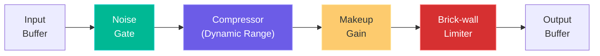

# VolSteady — Real-Time Audio Stabilizer for Windows

A lightweight system-wide audio stabilizer that eliminates sudden volume jumps in movies, videos, and loudspeaker playback. It compresses loud sounds, boosts quiet dialogue, and prevents painful volume spikes — all in real-time with minimal latency and near-zero CPU usage.

## How It Works (High-Level)


> [!IMPORTANT]
> **The Feedback Loop Problem**: WASAPI loopback captures audio from the output device. If we play the processed audio back to the *same* device, it gets captured again → infinite feedback loop.
>
> **Solution**: VolSteady mutes the system volume on the Windows audio endpoint (via `pycaw`), captures the pre-mute audio stream via WASAPI loopback, processes it, and plays it back on a *separate output stream* that bypasses the mute. This gives us clean, feedback-free processing. Alternatively, the user can route through a Virtual Audio Cable for maximum flexibility.

---

## User Review Required

> [!WARNING]
> **Audio Routing Strategy** — There are two approaches. I recommend **Option A** for simplicity:
>
> - **Option A (Recommended — Zero Setup)**: Use WASAPI loopback to capture system audio + `pycaw` to mute the original output + play processed audio on an exclusive-mode output stream. No extra software needed. Limitation: takes exclusive control of the audio device while running.
>
> - **Option B (Virtual Audio Cable)**: Require the user to install a free virtual audio cable (like VB-Cable). User sets the virtual cable as default output → VolSteady captures from it → plays processed audio on real speakers. More flexible but requires one-time setup.

> [!IMPORTANT]
> **GUI Framework Choice**: I plan to use `tkinter` for a small settings window + `pystray` for the system tray icon. This keeps the app ~15-20 MB when packaged. An alternative would be a pure system-tray-only app with no visible window (all settings in tray menu). Which do you prefer?

## Open Questions

1. **Hotkey support?** — Should the app have a global hotkey (e.g., `Ctrl+Shift+V`) to toggle processing on/off instantly?
2. **Per-app control?** — Do you want per-application volume stabilization, or is system-wide sufficient?
3. **Preset profiles?** — Should we include preset profiles (Movie, Music, Gaming, Voice Call) or just one universal mode with a single "Strength" slider?

---

## Proposed Changes

### Technology Stack

| Component | Technology | Why |
|-----------|-----------|-----|
| Language | **Python 3.11+** | Fast development, numpy for DSP, easy packaging |
| Audio Capture | **PyAudioWPatch** | WASAPI loopback support on Windows |
| DSP Engine | **NumPy + Numba** | C-speed math via JIT compilation, zero-dependency DSP |
| Volume Control | **pycaw** | Native Windows audio endpoint control |
| System Tray | **pystray + Pillow** | Lightweight system tray with icon |
| Settings GUI | **tkinter** | Built into Python, zero extra dependencies |
| Packaging | **PyInstaller** | Single `.exe`, no Python install required |

### Project Structure

```
d:\VolSteady\
├── main.py                  # Entry point, app lifecycle
├── audio_engine.py          # WASAPI capture + playback streams
├── dsp/
│   ├── __init__.py
│   ├── pipeline.py          # DSP chain orchestrator
│   ├── compressor.py        # Dynamic range compressor
│   ├── limiter.py           # Brick-wall peak limiter
│   ├── gate.py              # Noise gate
│   └── level_detector.py    # RMS/Peak envelope follower
├── gui/
│   ├── __init__.py
│   ├── tray.py              # System tray icon + menu
│   └── settings_window.py   # tkinter settings panel
├── config.py                # Settings management (JSON)
├── utils.py                 # Helpers, logging
├── assets/
│   └── icon.ico             # App icon
├── requirements.txt
├── build.spec               # PyInstaller spec
└── README.md
```

---

### Core Audio Engine

#### [NEW] [audio_engine.py](file:///d:/VolSteady/audio_engine.py)

The heart of the application. Manages two concurrent audio streams:

- **Capture Stream**: Opens WASAPI loopback on the default output device to capture all system audio
- **Playback Stream**: Opens a separate output stream (exclusive mode) to play processed audio
- **Callback Architecture**: Uses PyAudioWPatch's callback mode for lowest latency (~10ms buffer)

```python
# Pseudocode for the core loop
def audio_callback(in_data, frame_count, time_info, status):
    audio_chunk = np.frombuffer(in_data, dtype=np.float32)
    processed = dsp_pipeline.process(audio_chunk)
    return (processed.tobytes(), pyaudio.paContinue)
```

Key design decisions:
- **Buffer size**: 512 samples (~10ms at 48kHz) — low latency without glitching
- **Sample format**: 32-bit float throughout the pipeline (no conversion overhead)
- **Thread safety**: Audio callback runs in a separate high-priority thread; settings updates are atomic

---

### DSP Pipeline

#### [NEW] [dsp/pipeline.py](file:///d:/VolSteady/dsp/pipeline.py)

Orchestrates the processing chain in this exact order:



Each stage maintains its own state (envelope values) across buffer boundaries for seamless, glitch-free processing.

#### [NEW] [dsp/level_detector.py](file:///d:/VolSteady/dsp/level_detector.py)

Envelope follower using exponential smoothing with separate attack/release coefficients:

- **RMS detection** for the compressor (smoother, better for music/dialogue)
- **Peak detection** for the limiter (catches transients)
- Coefficients calculated from attack/release times in milliseconds
- Uses `@numba.jit` for per-sample processing at C speed

#### [NEW] [dsp/gate.py](file:///d:/VolSteady/dsp/gate.py)

Noise gate to suppress background hiss/hum during silent passages:

| Parameter | Default | Purpose |
|-----------|---------|---------|
| Threshold | -50 dB | Below this = silence |
| Attack | 0.5 ms | How fast the gate opens |
| Release | 50 ms | How fast it closes (smooth fade) |
| Hold | 20 ms | Keeps gate open briefly after signal drops |

- Prevents choppy artifacts with a smooth gain envelope
- `@numba.jit` compiled for real-time performance

#### [NEW] [dsp/compressor.py](file:///d:/VolSteady/dsp/compressor.py)

The main dynamic range compressor — this is what actually stabilizes volume:

| Parameter | Default | Purpose |
|-----------|---------|---------|
| Threshold | -25 dB | Level where compression kicks in |
| Ratio | 4:1 | How aggressively to compress (4:1 means 4dB input increase → 1dB output increase) |
| Attack | 10 ms | How quickly to react to loud sounds |
| Release | 200 ms | How quickly to release after loud sounds pass |
| Knee | 6 dB | Soft-knee for natural-sounding compression |

Algorithm:
1. Compute RMS envelope of the input buffer (per-sample, stateful)
2. Convert to dB scale
3. Apply soft-knee gain reduction curve
4. Smooth the gain reduction with attack/release ballistics
5. Apply gain reduction to each sample

**Soft-knee** ensures the transition from uncompressed to compressed is gradual and inaudible.

#### [NEW] [dsp/limiter.py](file:///d:/VolSteady/dsp/limiter.py)

Brick-wall peak limiter as the final safety net:

| Parameter | Default | Purpose |
|-----------|---------|---------|
| Ceiling | -1.0 dB | Maximum allowed peak level |
| Release | 50 ms | Recovery time |
| Lookahead | 5 ms | Catches transients before they clip |

- Uses a lookahead delay buffer to anticipate peaks
- Guarantees output NEVER exceeds the ceiling — no clipping, no distortion
- Essential for preventing those painful loudspeaker spikes

---

### GUI Layer

#### [NEW] [gui/tray.py](file:///d:/VolSteady/gui/tray.py)

System tray icon with right-click menu:

```
🔊 VolSteady (System Tray)
├── ✅ Enabled / ❌ Disabled  (toggle processing)
├── ──────────────
├── Strength: [Low | Medium | High]
├── ──────────────
├── ⚙️ Settings...           (opens settings window)
├── 📊 Show Level Meter      (opens floating meter)
├── ──────────────
└── ❌ Quit
```

- Green icon = active, gray icon = bypassed
- Tooltip shows current status and CPU usage
- Double-click to open settings

#### [NEW] [gui/settings_window.py](file:///d:/VolSteady/gui/settings_window.py)

A compact tkinter window (~400×500px) with:

- **Strength slider** (maps to compressor ratio + threshold preset): Simple 0–100% control
- **Advanced section** (collapsible): Individual sliders for threshold, ratio, attack, release, gate threshold, limiter ceiling
- **Audio device selector**: Dropdown to pick which output device to capture from
- **Level meters**: Input level bar (green/yellow/red) and output level bar, plus gain reduction meter
- **Bypass button**: Instantly toggle processing on/off for A/B comparison

---

### Configuration

#### [NEW] [config.py](file:///d:/VolSteady/config.py)

Settings persisted to `%APPDATA%\VolSteady\settings.json`:

```json
{
  "enabled": true,
  "strength": 65,
  "advanced": {
    "compressor_threshold_db": -25,
    "compressor_ratio": 4.0,
    "compressor_attack_ms": 10,
    "compressor_release_ms": 200,
    "compressor_knee_db": 6,
    "gate_threshold_db": -50,
    "gate_attack_ms": 0.5,
    "gate_release_ms": 50,
    "limiter_ceiling_db": -1.0,
    "limiter_release_ms": 50,
    "makeup_gain_db": 0
  },
  "audio_device": "default",
  "start_minimized": true,
  "auto_start": false
}
```

- Auto-saves on every change
- Thread-safe reads from the audio callback

---

### Application Entry Point

#### [NEW] [main.py](file:///d:/VolSteady/main.py)

- Parse command-line args (`--minimized`, `--device`)
- Load config
- Initialize audio engine
- Start system tray
- Handle graceful shutdown (restore original volume on exit)

#### [NEW] [utils.py](file:///d:/VolSteady/utils.py)

- Logging setup (to `%APPDATA%\VolSteady\volsteady.log`)
- dB ↔ linear conversion helpers
- Single-instance lock (prevent running two copies)

---

### Build & Packaging

#### [NEW] [requirements.txt](file:///d:/VolSteady/requirements.txt)

```
PyAudioWPatch>=0.2.12
numpy>=1.24
numba>=0.57
pycaw>=20230407
pystray>=0.19
Pillow>=9.0
comtypes>=1.2
```

#### [NEW] [build.spec](file:///d:/VolSteady/build.spec)

PyInstaller configuration for a single-file `.exe`:
- `--onefile --noconsole --icon=assets/icon.ico`
- Expected size: ~25-30 MB (numpy + numba are the bulk)
- Startup time: ~2-3 seconds

---

## Performance Targets

| Metric | Target |
|--------|--------|
| CPU Usage | < 2% (on modern hardware) |
| Latency | < 15ms (inaudible) |
| Memory | < 50 MB |
| Exe Size | ~25-30 MB |
| Buffer Size | 512 samples (~10ms at 48kHz) |

---

## Verification Plan

### Automated Tests
```bash
# Unit tests for DSP modules
python -m pytest tests/ -v

# Test cases:
# 1. Sine wave at -5dB → output should be compressed below threshold
# 2. Silent input → gate should mute output (no noise floor)
# 3. Sudden 0dBFS spike → limiter should clamp to -1dB ceiling
# 4. Quiet whisper at -40dB → should be boosted by makeup gain
# 5. Verify no clipping: all output samples within [-1.0, 1.0]
```

### Manual Verification
1. **Movie Test**: Play a movie scene with alternating whisper dialogue and explosions → volume should stay stable
2. **YouTube Test**: Switch between a quiet ASMR video and a loud music video → no painful volume jump
3. **Loudspeaker Test**: Play music on speakers → sudden volume increase in song should be tamed
4. **Latency Test**: Clap in a live video call → verify no perceptible delay
5. **CPU Test**: Run for 1 hour with Task Manager open → verify < 2% CPU
6. **A/B Test**: Toggle bypass on/off during playback → verify natural sound quality when processing

### Build Verification
```bash
# Package into single exe
pyinstaller build.spec

# Verify exe runs on clean Windows machine (no Python installed)
# Verify system tray icon appears
# Verify settings persist across restarts
```
